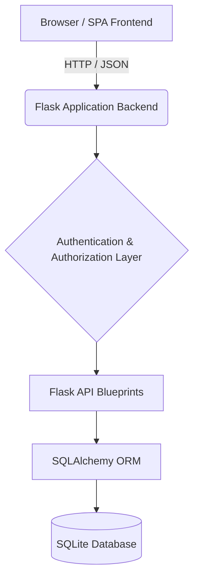

# Architecture Overview

## High-Level Architecture

Student Manager uses a classic three-tier architecture implemented as a Single Page Application (SPA) communicating with a RESTful JSON API.

## Layers & Responsibilities

### 1. Frontend (Browser)
- **Technology:** Vanilla HTML, CSS, JavaScript (ES6).
- **Responsibilities:**
  - Provide a responsive UI using CSS custom properties.
  - Manage client-side routing via hash (`#/students`, `#/courses`).
  - Maintain the theme preference (System/Light/Dark) in `localStorage`.
  - Fetch data asynchronously and update the DOM directly.
  - Conditionally render UI elements (like "Add" buttons) based on the current user's role.

### 2. API Backend (Flask Application)
- **Technology:** Python 3, Flask.
- **Responsibilities:**
  - Route HTTP requests to the appropriate handlers via Flask Blueprints (`app/routes/`).
  - Process JSON payloads and handle request validation.
  - Centralize error handling (JSON error responses).
  - Serve static assets (HTML/CSS/JS).

### 3. Security Layer (Authentication & Authorization)
- **Technology:** Flask session, custom decorators.
- **Responsibilities:**
  - **Authentication:** Verify user identity (username/password), manage secure HTTP-only sessions, and inject the `User` object into `flask.g`.
  - **Authorization:** `before_request` hooks and `@role_required` decorators ensure that the authenticated user possesses the correct role (Admin, Teacher, Student) to access a resource or execute a specific HTTP method (e.g., `POST`, `DELETE`).

### 4. Data Access (SQLAlchemy ORM)
- **Technology:** SQLAlchemy.
- **Responsibilities:**
  - Map Python objects to database records (Object-Relational Mapping).
  - Manage relationships between tables (e.g., Student ↔ Enrollment ↔ Course).
  - Serialize models into Python dictionaries for JSON conversion.

### 5. Database
- **Technology:** SQLite, Flask-Migrate (Alembic).
- **Responsibilities:**
  - Persist application data.
  - Enforce data integrity via schema constraints (e.g., `UNIQUE`, `CHECK(credits > 0)`).
  - Provide fast lookups via B-tree indexes on foreign keys and unique identifiers.

## Request Flow Example (Creating an Enrollment)

1. The Admin clicks "Create" in the Add Enrollment modal.
2. The frontend JavaScript (`app.js`) sends a `POST` request to `/api/enrollments` with the selected IDs and grade.
3. The Flask application receives the request.
4. The `_require_auth_for_api` hook verifies the session cookie.
5. The `_enforce_rbac` hook verifies the user has `admin` role (teachers/students are forbidden from creating enrollments).
6. The `enrollments.py` blueprint validates the payload.
7. SQLAlchemy constructs a new `Enrollment` instance and adds it to the session.
8. SQLAlchemy translates the commit into an SQL `INSERT` statement.
9. SQLite executes the insert (enforcing the unique composite constraint and check constraints).
10. The blueprint returns a `201 Created` JSON response.
11. The frontend displays a success toast and refreshes the table data.
