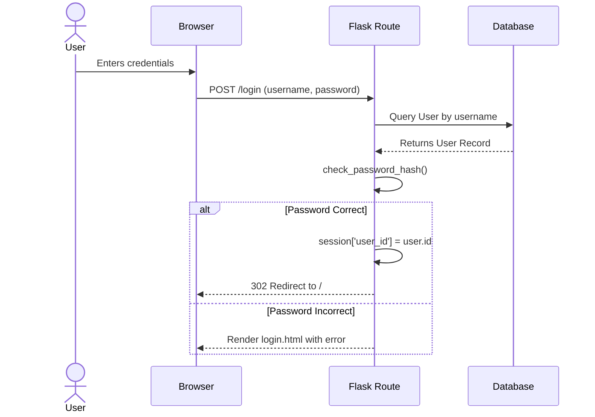

# Authentication

## Overview

The Student Manager utilizes session-based authentication handled securely on the backend via Flask's built-in session management.

## User Model

The `user` table stores authentication records:
- `id`: Primary key.
- `username`: Unique username (primary login identifier).
- `email`: Unique email (alternative login identifier).
- `password_hash`: Cryptographic hash (plaintext is NEVER stored).
- `role`: Role identifier (`admin`, `teacher`, `student`).

## Login Flow

1. User visits `/login`.
2. User submits credentials (username/email + password) via a `POST` request to `/login`.
3. The `auth.login_post` route fetches the user from the database.
4. The password is verified using `werkzeug.security.check_password_hash`.
5. Upon success, the `user_id` and `user_role` are stored in the secure Flask `session` object.
6. The user is redirected to `/` (the application dashboard).
7. Upon failure, the page re-renders with an error message.

## Session Configuration

- Flask signs the session cookie cryptographically using the `SECRET_KEY`.
- Sessions are strictly maintained by the browser. 
- The backend reads the cookie on subsequent requests to identify the user.

## Protected Routes & API Access

- Accessing `/` unauthenticated redirects to `/login`.
- Accessing any `/api/*` endpoint unauthenticated (except `/api/health`) triggers a `before_request` hook which intercepts the request and immediately returns a `401 Unauthorized` JSON response.

## `/api/auth/me` Endpoint

- **Method:** `GET`
- **Purpose:** Allows the frontend SPA to discover who is currently logged in.
- **Response:**
  ```json
  {
    "id": 1,
    "username": "admin",
    "email": "admin@example.com",
    "role": "admin"
  }
  ```
- **Note:** This response is mapped into `window.currentUser` globally in the browser for UI conditional rendering (e.g., showing/hiding the "Add Student" button).

## Logout Flow

1. User clicks "Log out" inside the Settings menu.
2. A confirmation modal appears.
3. Upon confirming, JavaScript submits a hidden form `POST /logout`.
4. The `auth.logout` route clears the Flask session (`session.clear()`).
5. The user is redirected back to `/login`.

## Sequence Diagram: Login Flow


