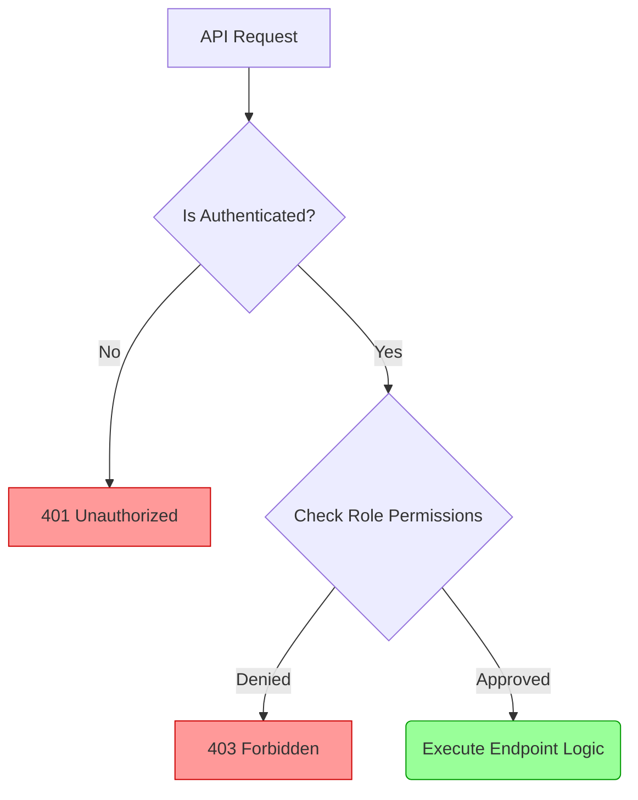

# Authorization (RBAC)

## Concept

While Authentication verifies *who* the user is, **Authorization** verifies *what* the user is permitted to do. Student Manager uses a strict Role-Based Access Control (RBAC) paradigm.

## Roles Defined

1. **Admin (`admin`)**: Complete system access.
2. **Teacher (`teacher`)**: Can read all data. Can update academic grades and statuses. Cannot create or delete major records.
3. **Student (`student`)**: Read-only access to academic structure (Courses, Semesters) and isolated view of their own enrollments.

## Permission Matrix

| Resource | Admin | Teacher | Student |
|---|---|---|---|
| **Students** | CRUD | Read | *No Access* |
| **Courses** | CRUD | Read | Read |
| **Semesters**| CRUD | Read | Read |
| **Enrollments**| CRUD | Read, Update | Read (Own Only)* |
| **Users** | CRUD | *No Access* | *No Access* |
| **Settings** | Yes | Yes | Yes |

*\* Limitation: A student's identity is dynamically resolved by matching `User.email` against `Student.email`. If a match is found, they only see enrollments for that specific `Student.id`. If no match is found, they receive 0 records.*

## Backend Enforcement

Security relies strictly on the backend. It does NOT rely on hiding buttons in the UI.

1. **`before_request` hook:** Intercepts all requests matching `/api/*`.
2. **Authentication Check:** Yields `401 Unauthorized` if the session is absent.
3. **Authorization Check:** Evaluates the `request.method` and `request.path` against the `user.role`. Yields `403 Forbidden` if the action is restricted.
4. **Data Isolation (Student):** The backend dynamically intercepts `GET /api/enrollments`, looks up the student ID associated with the logged-in email, and injects a strict SQL `WHERE student_id = X` filter, entirely blocking access to other students' grades.

### Role-Based Access Diagram

