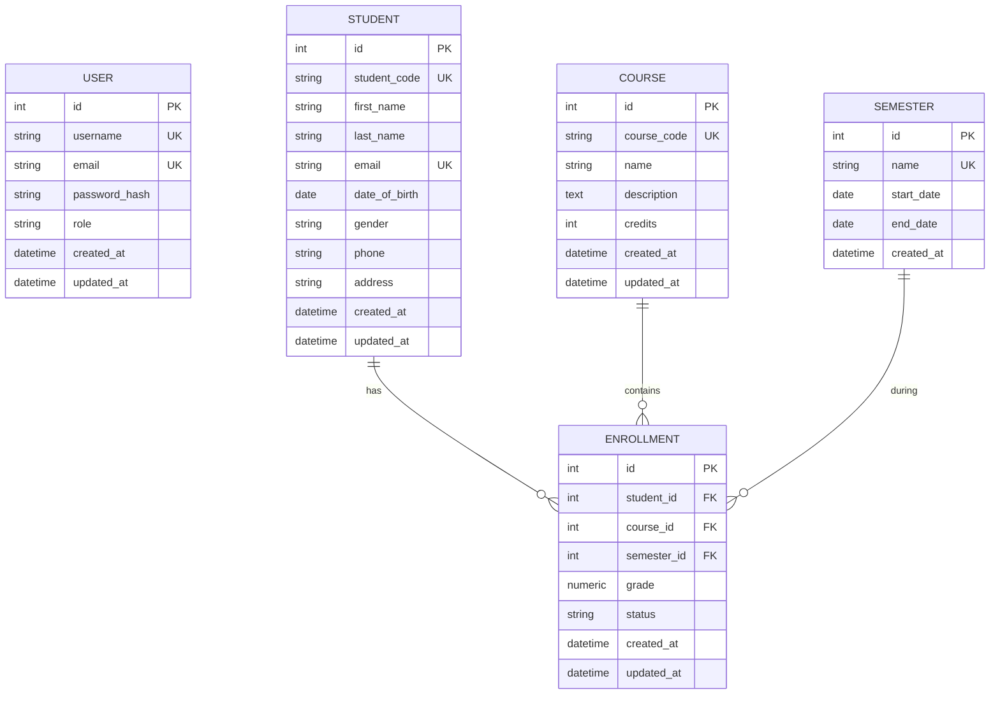

# Database Design

## Entity-Relationship Diagram (ERD)

## Tables & Constraints

### 1. `user`
- **Primary Key:** `id`
- **Unique Indexes:** `username`, `email`
- **Description:** Stores system users for authentication and authorization. Passwords are encrypted (`password_hash`).

### 2. `student`
- **Primary Key:** `id`
- **Unique Indexes:** `student_code`, `email`
- **Description:** Stores biographical data of students. Deleting a student cascades to delete their `enrollment` records.

### 3. `course`
- **Primary Key:** `id`
- **Unique Indexes:** `course_code`
- **Constraints:** `CHECK(credits > 0)` (Enforces valid credit weights).
- **Description:** Stores academic courses.

### 4. `semester`
- **Primary Key:** `id`
- **Unique Indexes:** `name` (e.g., "Fall 2026")
- **Constraints:** `CHECK(end_date >= start_date)` (Enforces chronological integrity).
- **Description:** Defines academic terms.

### 5. `enrollment` (Junction Table)
- **Primary Key:** `id`
- **Foreign Keys:** `student_id`, `course_id`, `semester_id` (All indexed for fast lookups).
- **Constraints:** 
  - `UNIQUE(student_id, course_id, semester_id)`: A student cannot enroll in the same course twice during the same semester.
  - `CHECK(grade >= 0 AND grade <= 10)`: Enforces the Vietnamese grading scale.
- **Data Types:** `grade` is stored as `Numeric(4, 2)` to preserve precise decimal accuracy.
- **Description:** The central junction table linking students to courses within a specific semester.
