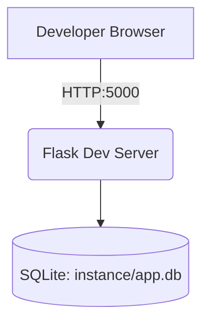
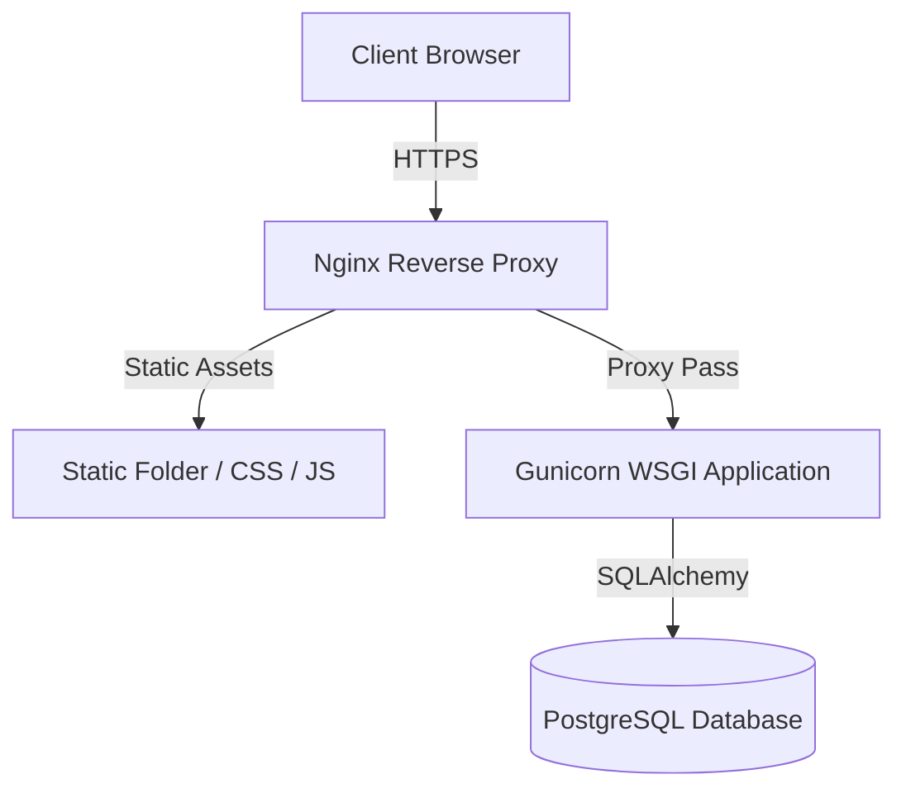

# Deployment

## Current Development Deployment

The current system relies heavily on local execution for development and testing.

- **Server:** Flask development server (Werkzeug).
- **Database:** Local SQLite file (`instance/app.db`).
- **Secrets:** Fallback static secrets for session execution (`dev-secret-key-change-in-production`).
- **Execution:** Runs natively via `python run.py`.

### Development Deployment Diagram

## Potential Production Deployment (Proposed Future Architecture)

If Student Manager is taken to production, the architecture must scale and be secured.

- **Web Server:** Gunicorn or uWSGI (WSGI compatible servers to handle concurrent requests).
- **Reverse Proxy:** Nginx (To handle SSL termination, static file serving, and proxy passing).
- **Database:** PostgreSQL or MySQL (SQLite is not suited for concurrent, high-availability production web systems).
- **Security:** `SESSION_COOKIE_SECURE=True`, proper environment variable management for `SECRET_KEY`, and HTTPS enforcement.

### Proposed Production Deployment Diagram

