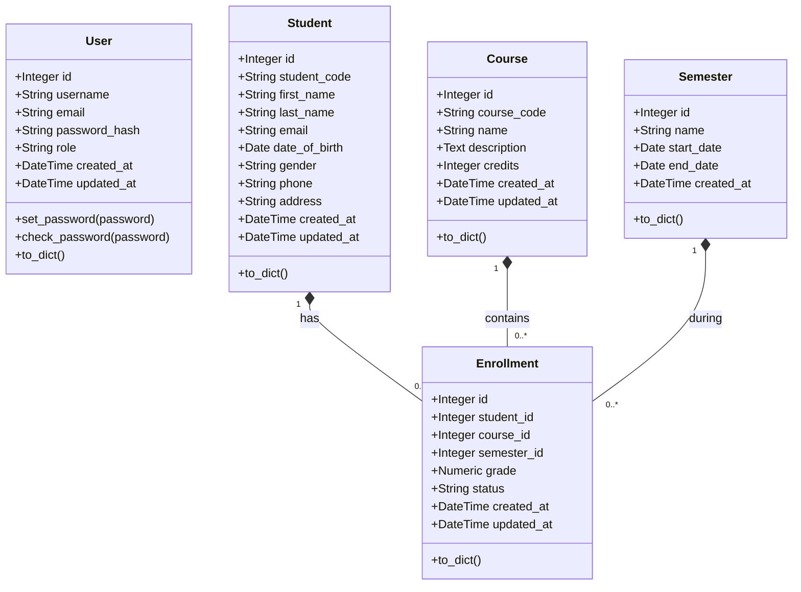

# Class Diagram

This diagram reflects the backend ORM models managed by SQLAlchemy.

```mermaid
classDiagram
    class User {
        +Integer id
        +String username
        +String email
        +String password_hash
        +String role
        +DateTime created_at
        +DateTime updated_at
        +set_password(password)
        +check_password(password)
        +to_dict()
    }

    class Student {
        +Integer id
        +String student_code
        +String first_name
        +String last_name
        +String email
        +Date date_of_birth
        +String gender
        +String phone
        +String address
        +DateTime created_at
        +DateTime updated_at
        +to_dict()
    }

    class Course {
        +Integer id
        +String course_code
        +String name
        +Text description
        +Integer credits
        +DateTime created_at
        +DateTime updated_at
        +to_dict()
    }

    class Semester {
        +Integer id
        +String name
        +Date start_date
        +Date end_date
        +DateTime created_at
        +to_dict()
    }

    class Enrollment {
        +Integer id
        +Integer student_id
        +Integer course_id
        +Integer semester_id
        +Numeric grade
        +String status
        +DateTime created_at
        +DateTime updated_at
        +to_dict()
    }

    Student "1" *-- "0..*" Enrollment : has
    Course "1" *-- "0..*" Enrollment : contains
    Semester "1" *-- "0..*" Enrollment : during
```
