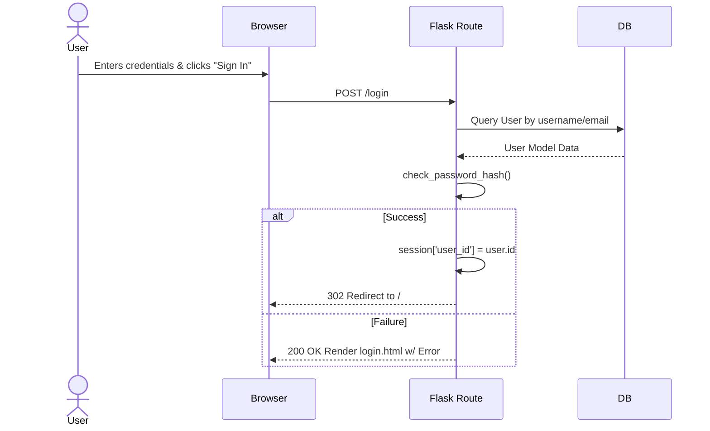
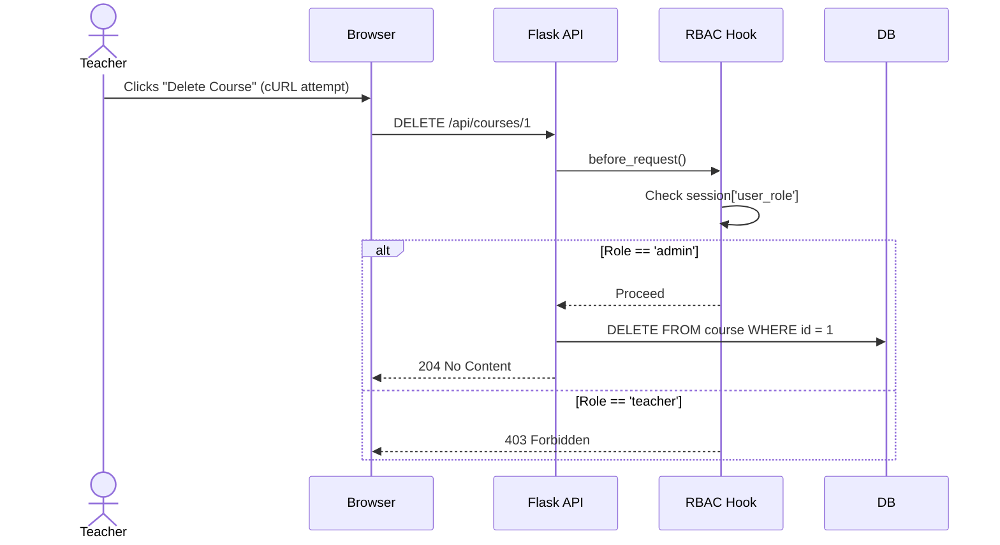
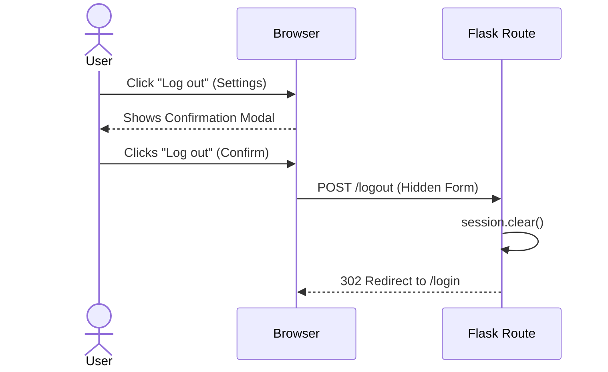
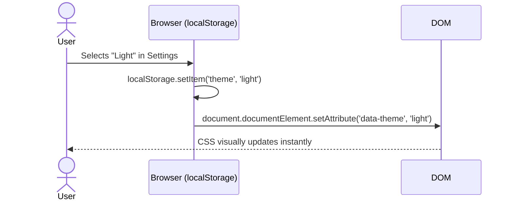

# Sequence Diagrams

## 1. Login Flow

```mermaid
sequenceDiagram
    actor User
    participant Browser
    participant Flask Route
    participant DB

    User->>Browser: Enters credentials & clicks "Sign In"
    Browser->>Flask Route: POST /login
    Flask Route->>DB: Query User by username/email
    DB-->>Flask Route: User Model Data
    Flask Route->>Flask Route: check_password_hash()
    
    alt Success
        Flask Route->>Flask Route: session['user_id'] = user.id
        Flask Route-->>Browser: 302 Redirect to /
    else Failure
        Flask Route-->>Browser: 200 OK Render login.html w/ Error
    end
```

## 2. API Authorization (CRUD Flow)

```mermaid
sequenceDiagram
    actor Teacher
    participant Browser
    participant Flask API
    participant RBAC Hook
    participant DB

    Teacher->>Browser: Clicks "Delete Course" (cURL attempt)
    Browser->>Flask API: DELETE /api/courses/1
    Flask API->>RBAC Hook: before_request()
    RBAC Hook->>RBAC Hook: Check session['user_role']
    
    alt Role == 'admin'
        RBAC Hook-->>Flask API: Proceed
        Flask API->>DB: DELETE FROM course WHERE id = 1
        Flask API-->>Browser: 204 No Content
    else Role == 'teacher'
        RBAC Hook-->>Browser: 403 Forbidden
    end
```

## 3. Logout Flow

```mermaid
sequenceDiagram
    actor User
    participant Browser
    participant Flask Route

    User->>Browser: Click "Log out" (Settings)
    Browser-->>User: Shows Confirmation Modal
    User->>Browser: Clicks "Log out" (Confirm)
    Browser->>Flask Route: POST /logout (Hidden Form)
    Flask Route->>Flask Route: session.clear()
    Flask Route-->>Browser: 302 Redirect to /login
```

## 4. Theme Change Flow

```mermaid
sequenceDiagram
    actor User
    participant Browser (localStorage)
    participant DOM

    User->>Browser (localStorage): Selects "Light" in Settings
    Browser (localStorage)->>Browser (localStorage): localStorage.setItem('theme', 'light')
    Browser (localStorage)->>DOM: document.documentElement.setAttribute('data-theme', 'light')
    DOM-->>User: CSS visually updates instantly
```
